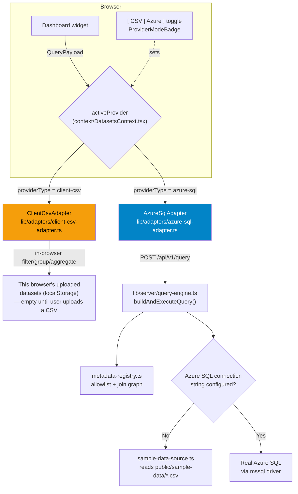
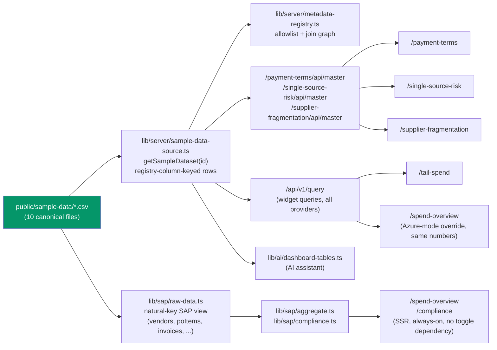
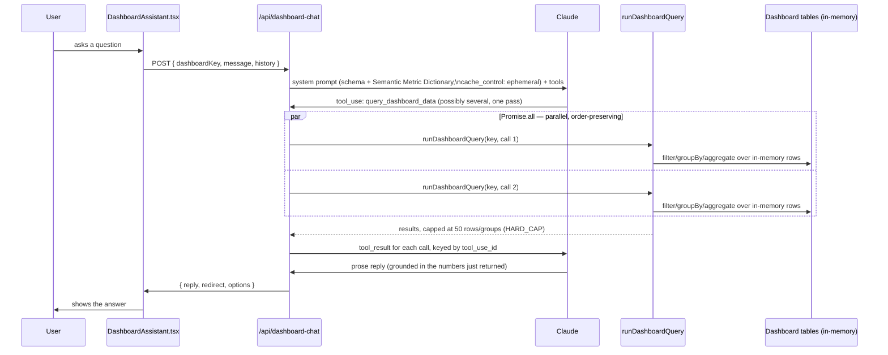

# Platform Architecture

How Vedanta Spend Analytics gets numbers onto a chart, and how its AI
assistant answers a question — from the canonical 10-table dataset through to
the 5 dashboard routes and the per-dashboard chatbot.

> **Audience:** engineers onboarding onto this codebase. Read §1 and §2 before
> touching anything under `lib/adapters/`, `lib/server/`, or `lib/sap/`.
>
> **Related docs:** [`DATA_DICTIONARY_MAPPING.md`](DATA_DICTIONARY_MAPPING.md)
> covers what the 10 tables *contain*; this doc covers how they get *loaded
> and queried*. This file supersedes and replaces the repo's former root-level
> `ARCHITECTURE.md` and `docs/ai-assistant-implementation.md`, both of which
> predated the 10-table unification and described an `/api/assistant` route
> that no longer exists — see [§7](#7-documentation-history) for what was
> carried forward from each.

---

## Table of contents

1. [System overview & the dual data-provider architecture](#1-system-overview--the-dual-data-provider-architecture)
2. [Single source of truth: from CSV to dashboard](#2-single-source-of-truth-from-csv-to-dashboard)
3. [Per-dashboard wiring](#3-per-dashboard-wiring)
4. [AI assistant architecture](#4-ai-assistant-architecture)
5. [Developer maintenance guide](#5-developer-maintenance-guide)
6. [File map](#6-file-map)
7. [Documentation history](#7-documentation-history)
8. [Appendix A: Provider adapter internals](#appendix-a-provider-adapter-internals)
9. [Appendix B: Dashboard-generation pipeline](#appendix-b-dashboard-generation-pipeline)

---

## 1. System overview & the dual data-provider architecture

Every widget on every dashboard reads through one interface,
[`types/data-provider.ts`](../types/data-provider.ts):

```ts
export interface IDataProvider {
  id: string;
  getDatasets(): Promise<Dataset[]>;
  getDatasetMetadata(datasetId: string): Promise<ColumnMeta[]>;
  queryWidgetData(payload: QueryPayload): Promise<QueryResult>;
}
```

`queryWidgetData` takes a **declarative aggregate description** (dimensions,
measures, filters, time grain, sort, limit) and returns only the finished
result — never raw rows for the UI to reduce itself. Two implementations
exist, and the header toggle `[ CSV | Azure ]` switches between them live, no
reload:



### The toggle's real meaning — read this before wiring a new widget

**The `[ CSV | Azure ]` toggle is not "canonical demo data vs. real
warehouse."** It is:

- **CSV mode** — `ClientCsvAdapter` aggregates whatever datasets **this
  browser has uploaded** (`context/DatasetsContext.tsx`'s `storedDatasets`,
  persisted to `localStorage`). Empty by default. This is the "bring your own
  spreadsheet" playground feature — it has nothing to do with the canonical
  10-table dataset unless a user manually uploads one of those CSVs.
- **Azure SQL mode** — `AzureSqlAdapter` posts to `/api/v1/query`, which
  queries a real Azure SQL database if `AZURE_SQL_READONLY_CONNECTION_STRING`
  (or the writable fallback) is set, and otherwise answers from the bundled
  canonical CSVs server-side (`sample-data-source.ts`) through the identical
  aggregation engine. **This is why Azure SQL mode is the default** —
  `NEXT_PUBLIC_DATA_SOURCE_PROVIDER` defaults to `azure-sql`, so a fresh
  session shows real canonical numbers without any configuration.

A dashboard that needs the canonical baseline data — not a user's uploaded
file — must **not** simply gate its fetch on `providerType === "azure-sql"`
and call it done. Two patterns are in use, both bypassing the toggle
entirely for baseline data:

1. **A dedicated `/api/master`-style route** that always calls
   `getSampleDataset()` server-side, regardless of `providerType` — used by
   Payment Terms (`app/payment-terms/api/master/route.ts`), Single Source
   Risk (`app/single-source-risk/api/master/route.ts`), and Supplier
   Fragmentation (`app/supplier-fragmentation/api/master/route.ts`). Needed
   whenever a page's model works off thousands of individual rows rather than
   a grouped aggregate — `queryWidgetData()`'s 1,000-row cap and
   `IDataProvider.getDatasets()` (which always reports `rows: []` for a
   server-backed dataset) have no way to return that many rows.
2. **Pinning directly to the exported `azureSqlAdapter` singleton** from
   `context/DatasetsContext.tsx`, bypassing `activeProvider` — used by Tail
   Spend (`lib/page-data/tail-spend-from-provider.ts`), whose loader issues
   grouped `queryWidgetData()` calls rather than a raw-row fetch.

Spend Overview and Compliance need neither pattern: their SSR path
(`lib/sap/raw-data.ts` → `lib/sap/aggregate.ts`/`compliance.ts`) reads the
canonical CSVs directly at the module level with zero dependency on
`providerType` at all — see §2.

### Provider comparison

| | CSV Mode | Azure SQL Mode |
|---|---|---|
| Provider | `ClientCsvAdapter` | `AzureSqlAdapter` |
| Where rows live | This browser tab's heap | Azure SQL, or the sample CSVs server-side |
| Where aggregation runs | Main thread, JavaScript | The database (T-SQL), or `ClientCsvAdapter` server-side over the samples |
| Data origin | A CSV the user uploaded | The star schema (if configured), else `public/sample-data/*.csv` |
| Row ceiling | Whatever fits in a tab | `MAX_ROWS = 1000` **returned**; scanned set unbounded |
| Network | None | `POST /api/v1/query` per widget |
| Default | No | **Yes** (`NEXT_PUBLIC_DATA_SOURCE_PROVIDER` defaults to `azure-sql`) |

---

## 2. Single source of truth: from CSV to dashboard

All 10 canonical CSVs live at `public/sample-data/*.csv`. Two server-only
modules read them, and **every** dashboard-facing data path ultimately goes
through one or the other:



**`lib/server/sample-data-source.ts`** — `getSampleDataset(datasetId)`
denormalizes a canonical CSV into rows keyed by the *registry's* column ids
(joining in vendor/category/plant/payment-term attributes, humanizing
`parent_company_group` via `humanizeGroupName()`, deriving
`is_contract_backed` from `doc_type`, etc.). This is what
`ClientCsvAdapter`/`AzureSqlAdapter`'s no-database fallback, every
`/api/master` route, and the AI assistant's `dashboard-tables.ts` all read.
One `readCsv()` + Papa.parse per file, cached after first read per process.

**`lib/sap/raw-data.ts`** — a *different* view over the *same* CSVs, keyed by
their own natural SAP-style fields (`vendor_id`, `po_number`, `category_code`,
...) rather than registry ids. This is what Spend Overview and Compliance's
pure computation modules (`lib/sap/aggregate.ts`, `lib/sap/compliance.ts`)
were originally built against, before the canonical CSVs existed — rewiring
this **one file** to read the canonical CSVs instead of the old bespoke mock
JSON was enough to make both pages canonical, with zero changes to the
aggregation logic itself. This is the clearest example of the "swap the
source, keep the shape" pattern this codebase uses repeatedly: preserve a
module's exact exported shape while changing what feeds it, so every
downstream consumer needs zero changes.

Both modules are `"server-only"` — neither can be imported into client
components. Every dashboard's actual data therefore either flows through a
server-rendered page (Spend Overview/Compliance), a server API route (the
`/api/master` pattern), or the shared `/api/v1/query` endpoint. No dashboard
reads a canonical CSV directly from the browser.

---

## 3. Per-dashboard wiring

| Dashboard | Canonical tables used | Load path |
|---|---|---|
| **Spend Overview** (`/spend-overview`) | `fact_po_items`, `fact_invoices`, `dim_vendor`, `dim_category`, `dim_plant` (join) | SSR via `lib/sap/raw-data.ts` → `lib/sap/aggregate.ts` (always); optionally overridden client-side by `app/spend-overview/loadFromProvider.ts` in Azure mode — same canonical numbers either way |
| **Compliance** (`/compliance`) | `fact_po_items`, `fact_invoices` (via `raw-data.ts`) | SSR via `lib/sap/raw-data.ts` → `lib/sap/compliance.ts` — no toggle dependency at all |
| **Payment Terms** (`/payment-terms`) | `fact_payments`, `dim_payment_terms`, `dim_vendor`, `dim_category`, `dim_plant` (join) | `app/payment-terms/api/master/route.ts` → `lib/page-data/payment-terms-from-provider.ts`, fetched unconditionally regardless of toggle |
| **Tail Spend** (`/tail-spend`) | `fact_po_items`, `fact_invoices`, `agg_vendor_annual` | `lib/page-data/tail-spend-from-provider.ts`, pinned to `azureSqlAdapter` regardless of toggle, issuing grouped `queryWidgetData()` calls |
| **Supplier Fragmentation** (`/supplier-fragmentation`) | `fact_po_items`, `dim_contract`, `dim_vendor`, `dim_category`, `dim_plant` (join) | `app/supplier-fragmentation/api/master/route.ts` → `app/supplier-fragmentation/lib/use-master-data.ts`, fetched unconditionally — the reference implementation this pattern was generalized from |
| **Single Source Risk** (`/single-source-risk`) | `fact_po_items`, `dim_vendor`, `dim_category`, `dim_plant` (join) | `app/single-source-risk/api/master/route.ts` → `lib/page-data/single-source-risk-from-provider.ts`, fetched unconditionally |

**All 5 dashboards show identical numbers regardless of the `[ CSV | Azure ]`
toggle position.** This is a verified, tested invariant, not an aspiration —
each dashboard's baseline load either has no toggle dependency at all
(Spend Overview/Compliance), or explicitly bypasses `activeProvider` for its
canonical data fetch (the other four). The toggle only changes behavior for
a dashboard's **ad hoc widget-level queries against a user-uploaded CSV**,
which is an orthogonal, opt-in feature layered on top.

---

## 4. AI assistant architecture

**One AI assistant surface exists today: `/api/dashboard-chat`.** An earlier
`/api/assistant` route (a general warehouse/uploaded-CSV chat with its own
`query_warehouse` tool) has been removed from the codebase entirely — see
[§7](#7-related-documentation--known-doc-drift) if you find a doc that still
describes it.



### 4.1 Scoped per-dashboard, not "all 10 tables at once"

The tool is `query_dashboard_data` (not a general warehouse-query tool), and
it is **scoped to exactly one dashboard's own tables** —
[`lib/ai/dashboard-tables.ts`](../lib/ai/dashboard-tables.ts):

```ts
const DASHBOARD_TABLES: Record<DashboardKey, DashboardTable[]> = {
  "spend-overview": [PO_ITEMS, INVOICES],
  compliance: [PO_ITEMS, INVOICES],
  "payment-terms": [PAYMENTS],
  "tail-spend": [PO_ITEMS, AGG_VENDOR_ANNUAL],
  "supplier-fragmentation": [PO_ITEMS, CONTRACTS],
  "single-source-risk": [PO_ITEMS],
};
```

Every table here is built from `getSampleDataset()` — the same registry-keyed
rows every dashboard itself renders from, never a separate copy. If the
model asks about data that belongs to a *different* dashboard, it calls
`redirect_to_dashboard` instead of guessing (a structural tool call the UI
renders as a real link, not free text it has to parse for a dashboard name).
Ambiguous questions ("which metric, which time range") get `ask_with_options`
— clickable choices instead of an open-ended follow-up.

**Containment is two layers**, same pattern as the widget-query path:

1. **Tool schema** (`strict: true` + `enum`) — the model cannot emit a
   table/field name that doesn't exist for the dashboard it was given.
2. **Engine-level validation** (`runDashboardQuery` in
   `lib/ai/dashboard-query.ts`) — catches what the enum alone can't, since
   the enum is a *union* across a dashboard's tables: a field real on one
   table but not the one actually requested in the call is rejected as a
   correctable `QUERY FAILED: ...` tool_result, never a silent empty result.

### 4.2 Query engine — separate from the widget-query engine

`lib/ai/query-engine.ts`'s `runQuery(rows, spec)` is a **synchronous,
in-memory** filter → groupBy → aggregate → sort → limit implementation over
plain JS row arrays. It is **not** the same module as
`lib/server/query-engine.ts` (which compiles to T-SQL for `/api/v1/query`) —
two files with a similar name doing different jobs is the easiest way to
optimize the wrong one, so this distinction is worth internalizing early.

Every result from the AI's engine is hard-capped:

```ts
// lib/ai/query-engine.ts
const HARD_CAP = 50;
const limit = Math.min(Math.max(1, spec.limit ?? 20), HARD_CAP);
```

This caps how many rows/groups the model ever sees in a `tool_result`,
independent of how many rows actually matched — the tool schema's own
`limit` field description states this explicitly ("Top-N cap, at most 50").

### 4.3 Performance optimizations

**Parallel tool-call execution.** When the model issues more than one
`query_dashboard_data` call in a single pass (a natural shape for "compare
this quarter to last"), `app/api/dashboard-chat/route.ts` runs them
concurrently and maps results back by `tool_use_id`:

```ts
const results: Anthropic.ToolResultBlockParam[] = await Promise.all(
  queryCalls.map(async (call) => {
    const outcome = runDashboardQuery(dashboardKey, call.input);
    return {
      type: "tool_result" as const,
      tool_use_id: call.id,
      is_error: outcome.error !== undefined,
      content: renderDashboardQueryResult(outcome),
    };
  })
);
```

`Promise.all` preserves input order in its resolved array regardless of
completion timing, which matters here since each result must land on the
`tool_use_id` of the call that produced it — a plain `for` loop awaiting one
call at a time would work correctly too, just serially; the model-facing
contract (each call gets its own correctly-matched result) is identical
either way.

**Multi-pass tool loop with a forced final answer.** Up to `MAX_TOOL_PASSES =
4` round trips; the *last* allowed pass sets `tool_choice: { type: "none" }`,
forcing a prose-only reply from whatever tool results already exist. This
closes off the failure mode where a query issued on the final pass would
otherwise never get read back into an answer.

**Prompt caching.** The system prompt (schema + Semantic Metric Dictionary)
carries `cache_control: { type: "ephemeral" }` and is rebuilt per
`dashboardKey` — byte-identical across requests for the same dashboard, so
repeat questions on the same dashboard reuse the cached prefix.

### 4.4 Semantic Metric Dictionary

Embedded directly in the system prompt
(`app/api/dashboard-chat/route.ts`'s `SEMANTIC_METRIC_DICTIONARY` constant) so
the model looks up a named business metric's exact computation instead of
inventing its own interpretation:

| Metric | Definition |
|---|---|
| **Off-contract / off-PO spend** | `fact_po_items` rows where `is_contract_backed = 0`, or `fact_invoices` rows where `po_number` is blank ("maverick" spend) |
| **Maverick spend %** | `count(fact_invoices where po_number is blank) ÷ count(fact_invoices) × 100` |
| **DPO (Days Payable Outstanding)** | `fact_payments.actual_dpo` — already computed as `clearing_date − baseline_date`. Never recomputed from other date fields |
| **Discount capture rate** | `fact_payments.discount_captured_inr ÷ discount_available_inr × 100` — only meaningful where `discount_available_inr > 0` |
| **Tail spend** | `agg_vendor_annual` rows where `is_tail = true` (equivalently `cumulative_spend_pct > 80` for that vendor's year) |
| **Pareto / 80-20 concentration** | `agg_vendor_annual.spend_rank` and `cumulative_spend_pct` are precomputed per vendor per year — read directly rather than re-ranking from `fact_po_items` |
| **Single-source / concentration risk** | `COUNT(DISTINCT vendor_id)` in `fact_po_items` grouped by category — at or below the user's stated threshold is "at risk" |
| **Contract coverage** | `dim_contract` rows where `is_active = true`, grouped by vendor/category/plant — `contract_value_inr` is committed value, not actual spend against it |
| **Supplier fragmentation** | `COUNT(DISTINCT vendor_id)` in `fact_po_items` per category — a high count relative to spend suggests consolidation potential |

The prompt also tells the model: amounts ending in `_inr` are Indian rupees,
report in Cr (10,000,000) or L (100,000) matching the dashboards' own
display convention; "top N" means sort descending and cap at N; and — for
context only, not as tables actually in reach on the current dashboard — the
full warehouse has seven top-level tables total.

---

## 5. Developer maintenance guide

### 5.1 Adding a new table

Registering a new canonical table is a **three-file change**:

1. **`lib/server/metadata-registry.ts`** — add a `DatasetDefinition` with its
   `id`, `primaryTable`, `defaultDateKey`, `allowedJoins` (which dimensions it
   can join, and the natural- or surrogate-key column pair to join on), and
   `columns` (one `column(id, name, type, table, sqlExpression, requiresJoin?,
   distinctCountHint?)` call per field). This is the **allowlist** — a field
   not declared here is a `400`, never reachable by any query regardless of
   provider.
2. **`lib/server/sample-data-source.ts`** — add a `build<Table>Rows(dims)`
   function that reads the new CSV via `readCsv()`, joins in whatever
   dimension attributes it needs from `loadDimensions()`, and returns rows
   keyed by the **registry's** column ids (not the CSV's raw headers — see
   `DATA_MAPPING.md` §8 for why these often differ). Register it in the
   `BUILDERS` map.
3. **If the table should be queryable by the AI assistant on a specific
   dashboard** — add a `DashboardTable` entry to `lib/ai/dashboard-tables.ts`
   (reusing the same `getSampleDataset()` rows) and reference it from that
   dashboard's array in `DASHBOARD_TABLES`. `dashboard-data-context.ts`,
   `dashboard-query.ts`, and the route's tool loop all operate on a resolved
   `DashboardDataContext` generically and need no further changes.

Skipping step 3 for a dashboard that should have it is not a no-op: a
dashboard's assistant only ever sees its own table list, so a table that
exists in the registry but not in `dashboard-tables.ts` is invisible to the
model on every dashboard's chat, even one that visibly renders it.

### 5.2 Quality checks

```bash
npx tsc --noEmit    # type-check the whole project
npm test            # node --conditions=react-server --import tsx --test tests/*.test.ts
npx eslint .        # lint
npm run build       # production build — also re-runs the type check
```

`node:test` is used deliberately, no test framework dependency. The
`--conditions=react-server` flag lets tests import modules marked
`server-only`. The most valuable pattern across the test suites is
**independent reconciliation** — a loader's output is compared against a
*separately computed* aggregate of the same source rows rather than against
itself, which is what has caught real bugs in this codebase before (a
supplier's total spend attributed entirely to its primary category; a KPI
counting PO documents instead of invoices under an "Invoices" label).

| Suite | Covers |
|---|---|
| `tests/query-builder.test.ts` | SQL shape, joins, grouping, Top-N, time grain, rejection of bad fields/operators/aliases/limits |
| `tests/azure-sql-adapter.test.ts` | Local-dataset routing, fallback on every failure class, error rethrow, metadata caching |
| `tests/page-data.test.ts` | Provider loaders issue only registry-valid payloads; totals reconcile against an independent aggregation |
| `tests/dashboard-query.test.ts` | `query_dashboard_data`'s per-dashboard enum scoping, cross-table field rejection, independent reconciliation against each dashboard's own warehouse totals |

---

## 6. File map

```
types/
  data-provider.ts              IDataProvider, QueryPayload, QueryResult, TimeGrain
  dataset.ts                    Dataset, DatasetRow  (source: "upload" | "server")

lib/adapters/
  client-csv-adapter.ts         in-browser engine: PapaParse + filter/group/aggregate/sort/limit
  azure-sql-adapter.ts          HTTP client over /api/v1/query + local-dataset routing + fallback

context/
  DatasetsContext.tsx           dataset store, providerType, activeProvider, exported azureSqlAdapter

lib/server/                     ── server-only ──
  metadata-registry.ts          the allowlist: 7 top-level datasets, columns, join graph
  query-builder.ts              QueryPayload → parameterized T-SQL
  query-engine.ts                buildAndExecuteQuery — the single SQL execution path
  sql-client.ts                 pooled mssql execution
  sample-data-source.ts         getSampleDataset() — canonical CSVs, registry-keyed rows
  sap-transforms.ts             FX rates, Indian fiscal calendar, humanizeGroupName()

lib/sap/                        ── the Spend Overview / Compliance SSOT ──
  raw-data.ts                   natural-key SAP view over the canonical CSVs (server-only)
  types.ts                      Vendor/Category/Plant/Material/PoItem/Invoice interfaces
  aggregate.ts                  pure computation: KPIs, treemap, top suppliers, trend, BU split
  compliance.ts                 off-PO / off-contract spend derivations

lib/page-data/                  provider aggregates → page shapes, per dashboard
  provider-queries.ts           shared query helpers ("push grouping down, derive in JS")
  payment-terms-from-provider.ts
  single-source-risk-from-provider.ts
  tail-spend-from-provider.ts

app/{payment-terms,single-source-risk,supplier-fragmentation}/api/master/route.ts
                                 dedicated raw-row endpoints, unconditional on providerType
app/spend-overview/loadFromProvider.ts
                                 Azure-mode override for Spend Overview's own widgets

lib/ai/                         ── the dashboard assistant, built-in AND generated ──
  dashboard-registry.ts         built-in routing/labels only — DashboardKey, route, description, no data
  dashboard-context.ts          WHICH dashboard: the DashboardContext union (builtin | custom),
                                 the one route→dashboard resolver, and the context id used as the
                                 key for conversation memory and caches. Client-safe.
  dashboard-data-context.ts     identity → data: resolves a DashboardContext to a
                                 DashboardDataContext (tables, label, business scope, versions)
                                 and renders its schema — never rows — into the system prompt
  dashboard-tables.ts           per-BUILT-IN-dashboard table lists, built from getSampleDataset()
  custom-dashboard-registry.ts  per-GENERATED-dashboard rows, registered by the browser that owns
                                 them (localStorage is the only store); TTL + row-budget bounded
  custom-dashboard-sync.ts      client half of that handover — register once, re-register on 409
  query-engine.ts               in-memory runQuery()/describeSchema() — §4.2, both kinds
  dashboard-query.ts            query_dashboard_data tool + validation + result rendering
  anthropic-client.ts           shared credential resolution

app/api/
  v1/query/route.ts             POST — the widget query engine (all providers)
  v1/datasets/route.ts          GET  — warehouse metadata
  dashboard-chat/route.ts       POST — the AI assistant, §4 — one endpoint for both dashboard kinds
  dashboard-context/route.ts    POST — registers a generated dashboard's rows with the assistant.
                                 No Claude call: a data handover, not a second chat endpoint

db/
  schema.sql                    Azure SQL star schema DDL — currently covers only
                                 fact_po_items/fact_invoices + their 6 original dimensions;
                                 fact_payments/agg_vendor_annual/dim_contract/dim_material have
                                 no db/schema.sql analog yet (CSV/registry-only)
scripts/
  seed-azure-sql.ts             CSV → star schema ETL (npm run seed:sql) — NOT executed as part
                                 of ordinary development; only run intentionally against a real DB
```

---

## 7. Documentation history

This file supersedes two now-deleted documents that had drifted out of date
with the codebase — both predated the 10-table canonical CSV unification and
the AI assistant consolidation onto `/api/dashboard-chat`, and both still
described an `app/api/assistant/route.ts` route, a `query_warehouse` tool,
and `lib/server/assistant-tools.ts`, none of which exist anymore:

- **`/ARCHITECTURE.md`** (repo root) — its §1–§3 (the `IDataProvider` seam,
  `ClientCsvAdapter`/`AzureSqlAdapter` internals, the star-schema rationale)
  were still accurate in shape and are carried forward, with corrected
  numbers and examples, in [Appendix A](#appendix-a-provider-adapter-internals)
  below. Its §4 (AI assistant integration), file map, and "known
  limitations" (which claimed Payment Terms couldn't be served from the
  warehouse — `fact_payments` closed that gap) described the deleted
  `/api/assistant` route and the pre-unification registry, and were not
  carried forward.
- **`docs/ai-assistant-implementation.md`** — its §2.3 (the
  `/api/generate-dashboard` two-call planning pipeline, a live surface this
  document hadn't covered elsewhere) and the still-applicable performance
  observations about the in-memory dashboard-chat query engine are carried
  forward in [Appendix B](#appendix-b-dashboard-generation-pipeline) and
  §4.2 above. Its §1–§2 and §4 described `/api/assistant` specifically and
  were not carried forward.

Both files were deleted when this document absorbed their still-valid
content. If you find a discrepancy between this doc and the code, trust the
code and update this doc — that is the whole point of having it.

---

## Appendix A: Provider adapter internals

Deeper mechanics behind §1's `ClientCsvAdapter`/`AzureSqlAdapter` comparison —
read this before modifying either adapter or debugging a cross-provider
numbers mismatch.

### `ClientCsvAdapter` — [`lib/adapters/client-csv-adapter.ts`](../lib/adapters/client-csv-adapter.ts)

Rows arrive via PapaParse (`parseCsv`) and live in `dataset.rows` as a plain
array of `Record<string, unknown>`. A query is a single-pass pipeline:

```
queryWidgetData(payload)
  │
  ├─ requireDataset(datasetId)          O(D)   lookup over loaded datasets
  ├─ filterRows(rows, filters)          O(N·F) Array.filter, per-cell compare
  ├─ aggregateRows(dataset, rows, …)    O(N·M) one pass, Map<groupKey, Accumulator>
  ├─ result.sort(comparator)            O(G log G)  G = distinct groups
  └─ result.slice(0, limit)             O(limit)
```

`N` = rows, `F` = filters, `M` = measure fields, `G` = groups. The dominant
term is **O(N)** — every query re-scans every row; there is no index, so
filtering on `po_number` costs exactly as much as filtering on
`currency_code`.

**Grouping.** `aggregateRows` builds a `Map` keyed by
`JSON.stringify(dimensionValues)`. Each entry holds a `GroupAccumulator`:

```ts
{ key: (string | null)[], rowCount: number, fields: Map<string, FieldAccumulator> }
//                                                       { sum, nonEmpty, distinct: Set<string> }
```

Accumulating `sum`, `nonEmpty`, and a `distinct` Set for every measure field in
the same pass is what lets one scan answer `sum`/`avg`/`count`/`distinct`
together.

**Aggregation semantics** (`finalizeMeasure`) — the contract the SQL side
must match:

| Aggregation | Client behaviour |
|---|---|
| `sum` | `acc.sum` |
| `avg` | `acc.sum / group.rowCount` — divided by **every row in the group**, not just rows carrying a number |
| `count` on `"*"` | `group.rowCount` |
| `count` on a column | `acc.nonEmpty` (non-null, non-empty-after-trim) |
| `distinct` | `acc.distinct.size` over trimmed text |

**Comparison is trimmed text.** `cellText()` coerces to `String` and trims, so
`" Steel "` matches `"Steel"` and `5` matches `"5"`. Ordered operators
(`gt`/`gte`/`lt`/`lte`) compare numerically when both sides coerce to numbers,
lexicographically otherwise — which is why ISO dates sort correctly.

**Empty groups sort first.** `compareDimension` treats `null` as less than any
string, matching T-SQL's default `ORDER BY … ASC` placement for `NULL`.

**Date bucketing in JavaScript.** `dimensionValue()` buckets any dimension
whose `ColumnMeta.type === "date"`. `timeGrain` defaults to `"month"`:

```
monthBucket("2025-03-14")            // "2025-03"   ISO fast path (regex slice)
monthBucket("14/03/2025")            // "2025-03"   falls back to new Date()
monthBucket("not a date")            // "not a date" — unparseable passes through

dateBucket(raw, "month")             // "2025-03"
dateBucket(raw, "quarter")           // "2025-Q1"   Math.ceil(month / 3)
dateBucket(raw, "year")              // "FY2024-25" Indian fiscal year
```

The fiscal-year rule — April–March, labelled by the **starting** year, so
January 2025 belongs to `FY2024-25`:

```ts
const fiscalYear = monthNumber >= 4 ? year : year - 1;
return `FY${fiscalYear}-${String((fiscalYear + 1) % 100).padStart(2, "0")}`;
```

Coarser grains derive *from* the month bucket, so anything `monthBucket`
cannot parse degrades identically at every grain.

> **These labels are a cross-provider contract.** `lib/server/
> query-builder.ts` emits T-SQL `CONCAT` expressions that produce
> byte-identical strings. If you change one, change both — otherwise a
> widget's x-axis labels shift when a warehouse query falls back to CSV
> mid-session.

### `AzureSqlAdapter` — [`lib/adapters/azure-sql-adapter.ts`](../lib/adapters/azure-sql-adapter.ts)

This adapter contains **no aggregation logic at all**. It is an HTTP client
plus two routing rules:

```
queryWidgetData(payload)
  │
  ├─ isLocalDataset(payload.datasetId)?
  │    └─ YES ──▶ fallback.queryWidgetData(payload)      ← correct route, not a failure
  │
  └─ NO
       ├─ postQuery(payload)
       │    └─ POST /api/v1/query
       │         ├─ 200 { success: true, data: QueryResult, source } ──▶ unwrap .data
       │         └─ else                                              ──▶ throw Error(envelope.error)
       │
       └─ catch (apiError)
            ├─ console.warn(reason + "Falling back to client-side aggregation")
            ├─ try fallback.queryWidgetData(payload) ──▶ return it
            └─ catch ──▶ throw apiError            ← rethrow the *original*, see below
```

**Smart routing: `isLocalDataset()`.** `DatasetsContext` wires this to the
live dataset store — `getSnapshot().datasets.some((d) => d.id === datasetId)`.
An uploaded CSV's rows exist **only** in that browser tab; the server has
never heard of a dataset called `ds-4f2c…`, so posting that payload would
earn a deterministic `400` once per widget, every render. The check
short-circuits those to the CSV engine *before* any network call —
**`isLocalDataset → true` is a routing decision, not a failure.** Nothing is
logged. The `catch` block below it is the actual fallback, firing only for
datasets the server was *supposed* to answer, on network failure, 4xx, 5xx,
a non-JSON body, or a 30s client timeout.

**Why the original error is rethrown on fallback failure:**

```ts
try {
  return await this.fallback.queryWidgetData(payload);
} catch {
  throw apiError;   // not the fallback's error
}
```

For a warehouse dataset the fallback has no rows, so `ClientCsvAdapter` throws
`Dataset "fact_po_items" is no longer loaded in this browser` — true but
useless, since it describes a consequence, not the cause. Rethrowing
`apiError` surfaces *"the query API returned 503: mssql driver not
installed"*, which is actionable.

**Metadata caching.** `fetchServerDatasets()` caches the **promise**, not the
result (`this.datasetsPromise ??= this.request(...)`), so a dashboard
mounting eight widgets at once shares one `GET /api/v1/datasets` round trip
rather than racing eight. A rejection clears the cache so the next attempt
retries; `invalidateMetadata()` clears it explicitly when the user toggles
back into Azure SQL Mode.

### Why a star schema?

The real comparison isn't "SQL vs. JavaScript" — it's **what each side must
hold in memory** and **what each side must repeat on every query**.

A flat CSV is fully denormalized by definition: every row carries every
attribute it might be grouped by. `fact_po_items.csv` (the PO-item grain)
repeats `vendor_name`, `parent_company_group`, `category_l1`/`category_l2`,
`plant_name`, and `region` — as **strings** — across 50,000 rows for 800
distinct vendors (an average ~62× duplication per vendor's full text
profile). The star schema stores that text **once**:

```
FLAT CSV (one array, every attribute inline on every row)
┌────────────┬──────────────┬───────────────────┬───────────────┐
│ po_number  │ vendor_name  │ parent_company... │ category_l1 … │
│ 4500000001 │ Tata Steel Ltd │ TATA GROUP       │ Raw Materials │
│ 4500000002 │ Tata Steel Ltd │ TATA GROUP       │ Raw Materials │  ← repeated
│ 4500000003 │ Tata Steel Ltd │ TATA GROUP       │ Fuel & Energy │  ← repeated
└────────────┴──────────────┴───────────────────┴───────────────┘

STAR SCHEMA (facts carry integer keys; text lives once per dimension row)
   dim_vendor (800 rows)             fact_po_items (50,000 rows)
   ┌────────────┬───────────────┐    ┌───────────┬─────────────┬──────────────┐
   │ vendor_key │ vendor_name   │◀───│ vendor_key│ category_key│ net_order_…  │
   │ 1          │ Tata Steel Ltd│    │ 1         │ 7           │ 6074838      │
   └────────────┴───────────────┘    │ 1         │ 7           │  950618      │
                                     │ 1         │ 3           │ 3916545      │
   dim_material_category (75)   ◀────┴───────────┴─────────────┴──────────────┘
```

To answer *"spend by vendor"* over a real SAP extract, the flat-array
approach requires the browser to download and parse the entire fact table
with all dimension text inlined — at millions of PO lines that file cannot
be transferred, parsed, or held in a tab. The star schema requires
transferring only the *aggregate*: for `fact_po_items` grouped by
`category_l1_name`, that's 13 rows regardless of whether the fact table
holds 50,000 rows or 100 million.

**Data integrity.** `fact_po_items` and `fact_invoices` both answer *"spend
by vendor"*/*"spend by category"* **consistently** because the registry
points both facts' `allowedJoins` at the *same* dimension tables — one
vendor row, one category row, referenced by key from both facts.
`db/schema.sql` enforces this with **12 foreign keys** and a `UNIQUE`
constraint on every dimension's business key, for the 2 facts it currently
covers. In a flat-array world, nothing structurally prevents `"Raw
Materials"` in one CSV from drifting to `"RAW MATERIALS"` in another —
those become two rows in a `GROUP BY` and the numbers silently stop
reconciling. The star schema converts that class of reporting bug into a
foreign-key violation at load time.

**Role-playing dimensions.** `fact_invoices` has two dates — the ledger
posting date and the supplier's document date. Rather than duplicating every
calendar attribute twice per fact row, the registry joins the single
`dim_date` table twice under different aliases (`dim_date` and
`dim_invoice_date`); the query builder emits `AS dim_invoice_date` only when
the alias differs from the table name, so both dates are queryable in one
statement without an ambiguous reference. `dim_date` also centralizes the
fiscal calendar — `fiscal_year`/`fiscal_quarter`/`fiscal_period` are columns
computed once, so every query agrees on where FY boundaries fall.

**Query efficiency.** `db/schema.sql` gives each fact a clustered columnstore
index (`CREATE CLUSTERED COLUMNSTORE INDEX CCI_fact_po_items ON
dbo.fact_po_items;`, and the same for `fact_invoices`). Dimensions keep
ordinary rowstore `PRIMARY KEY CLUSTERED` indexes — small enough to be
seeked, not scanned. The facts deliberately have **no surrogate primary
key**: the columnstore index *is* the storage structure, and a PK would add
a nonclustered B-tree the analytical query pattern never uses.

---

## Appendix B: Dashboard-generation pipeline

A **third** AI surface, separate from §4's per-dashboard chat: `/api/
generate-dashboard`, which plans a brand-new custom dashboard from a
user-uploaded dataset. Two sequential structured-output calls, no tool use,
no live queries — the model only ever sees a pre-computed column-statistics
profile, never raw rows:

```
POST /api/generate-dashboard  { profile: DatasetProfile }
  │
  ├─ CALL 1  system = lib/ai/skills/dashboard-planning.md (cache_control: ephemeral)
  │          input  = renderDatasetProfile(profile)
  │          output_config.format = PLAN_SCHEMA  →  parsed_output: DashboardPlan
  │
  └─ CALL 2  system = lib/ai/skills/widget-planning.md (cache_control: ephemeral)
             input  = profile + CALL 1's plan (JSON)
             output_config.format = WIDGET_SCHEMA → parsed_output: { widgets: WidgetSpec[] }
```

Both calls use `client.messages.parse()` with `jsonSchemaOutputFormat()` — no
JSON-extraction/regex step; the SDK validates and parses the structured
output for you. This is a standalone feature route: it does not import from,
and is not wired into, `/api/dashboard-chat` or the older custom-dashboard
builder — `components/generated-dashboard/generate-dashboard-dialog.tsx` is
its own frontend entry point.

**Related files:**

```
app/api/generate-dashboard/route.ts   the two-call pipeline above
lib/ai/profile/build-profile.ts       client-computed DatasetProfile (column stats only)
lib/ai/schemas/plan-schema.ts         DashboardPlan JSON schema
lib/ai/schemas/widget-schema.ts       WidgetSpec JSON schema
lib/ai/skills/dashboard-planning.md   system prompt for CALL 1
lib/ai/skills/widget-planning.md      system prompt for CALL 2
```

**Still-open performance notes**, carried forward from the retired
implementation audit since they haven't been addressed and apply to §4.2's
in-memory engine as much as to this pipeline:

- The in-memory dashboard-chat query engine (`lib/ai/query-engine.ts`) has no
  indexing or pagination — fine at current sample-data volumes; the first
  thing to revisit if `dashboard-tables.ts` is ever pointed at real SAP row
  counts, since `runQuery` re-scans the full array on every call.
- Neither AI surface caches a query result across conversation turns — a
  follow-up question that re-derives the same aggregate re-runs the full
  query. Worth adding if users are observed asking near-duplicate questions
  within one session; not measured either way yet.
