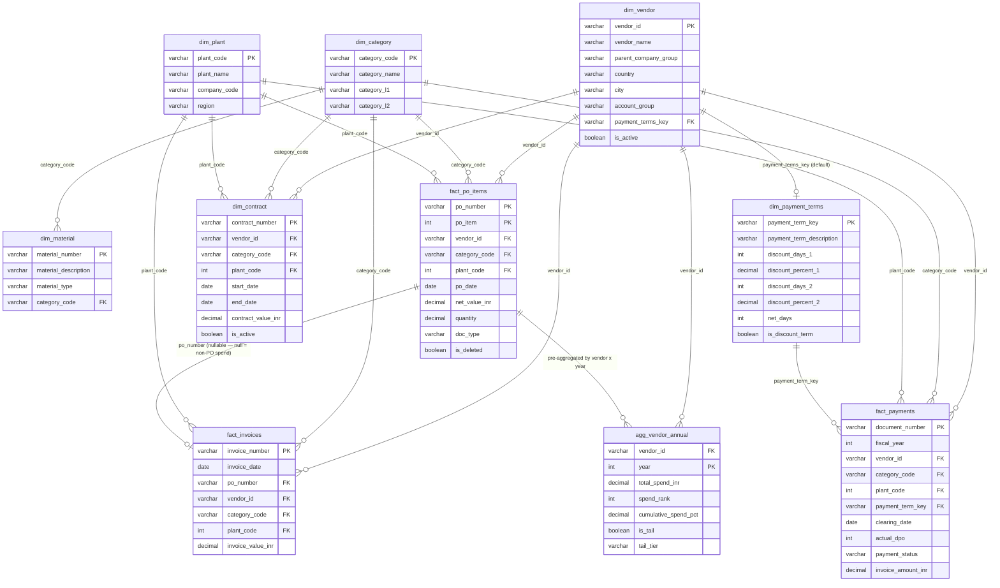

# Data Dictionary & SAP Field Mapping

Canonical reference for the 10-table data universe behind Vedanta Spend Analytics.
Every table listed here has a CSV at `public/sample-data/*.csv` and a matching
entry in [`lib/server/metadata-registry.ts`](../lib/server/metadata-registry.ts),
the allowlist that turns a dashboard's query into either an in-memory scan
(CSV/sample mode) or parameterized T-SQL (Azure SQL mode). Row counts, spend
totals, and business-unit codes below are verified directly against the current
CSVs, not estimated.

> **Companion doc:** [`ARCHITECTURE.md`](ARCHITECTURE.md) covers how these
> tables get loaded and queried. This doc covers what they *contain*.

---

## Table of contents

1. [Table catalog](#1-table-catalog)
2. [Entity-relationship diagram](#2-entity-relationship-diagram)
3. [Dimension tables](#3-dimension-tables)
4. [Fact tables](#4-fact-tables)
5. [Aggregate table](#5-aggregate-table)
6. [Business rules & allowed values](#6-business-rules--allowed-values)
7. [Key normalization & join rules](#7-key-normalization--join-rules)
8. [Registry column ↔ raw CSV column ↔ SAP source](#8-registry-column--raw-csv-column--sap-source)

---

## 1. Table catalog

| Table | Type | Rows | Grain | Primary use |
|---|---|---|---|---|
| `dim_vendor` | Dimension | 800 | one row per supplier | All 5 dashboards |
| `dim_category` | Dimension | 75 | one row per material group (L2) | All 5 dashboards |
| `dim_plant` | Dimension | 7 | one row per Vedanta business unit | All 5 dashboards |
| `dim_contract` | Dimension | 200 | one row per framework agreement | Supplier Fragmentation, Spend Overview |
| `dim_material` | Dimension | 2,156 | one row per SKU/material | Single Source Risk, Spend Overview (Products) |
| `dim_payment_terms` | Dimension | 15 | one row per payment-term code | Payment Terms |
| `fact_po_items` | Fact | 50,000 | one row per PO line item | All 5 dashboards |
| `fact_invoices` | Fact | 45,000 | one row per invoice line item | Spend Overview, Tail Spend |
| `fact_payments` | Fact | 45,000 | one row per accounting document | Payment Terms |
| `agg_vendor_annual` | Aggregate | 1,076 | one row per vendor × year | Tail Spend |

**Verified totals:** `fact_po_items.net_order_value_inr` sums to **₹24,361.25 Cr**;
`fact_invoices.invoice_value_inr` sums to **₹19,104.47 Cr**.

**Registry topology note:** in `metadata-registry.ts`, only 7 of these 10 are
top-level, independently-queryable `DatasetDefinition`s
(`fact_po_items`, `fact_invoices`, `fact_payments`, `agg_vendor_annual`,
`dim_contract`, `dim_material`, `dim_payment_terms`). `dim_vendor`, `dim_category`,
and `dim_plant` are **join-only** — every fact/dimension above joins out to them
for descriptive attributes, but you cannot query them directly as their own
dataset through `/api/v1/query`. This is a deliberate design choice, not a gap:
those three are pure lookup tables with no measures of their own to aggregate.

---

## 2. Entity-relationship diagram



`agg_vendor_annual` has no FK constraint in practice — it's pre-computed from
`fact_po_items` at generation time and denormalizes `vendor_name` /
`parent_company_group` directly onto itself so it needs no join to be useful on
its own.

---

## 3. Dimension tables

### `dim_vendor` — Supplier master

Derived from SAP `LFA1`/`LFB1`/`LFM1`. 800 rows, 754 active.

| Field | Type | Key | Description | SAP Source |
|---|---|---|---|---|
| `vendor_id` | VARCHAR(10) | **PK** | 10-digit zero-padded SAP vendor number | `LFA1.LIFNR` |
| `vendor_name` | VARCHAR(100) | | Supplier legal name | `LFA1.NAME1` |
| `parent_company_group` | VARCHAR(50) | | Corporate group key (KONZS) — see [§7.2](#72-corporate-grouping-konzs) | `LFA1.KONZS` |
| `country` | VARCHAR(2) | | ISO country code — 91% `IN`, rest US/DE/CN/JP/KR/AU/FI/DK/SE | `LFA1.LAND1` |
| `city` | VARCHAR(50) | | City of registered address | `LFA1.ORT01` |
| `account_group` | VARCHAR(4) | | `ZDOM` domestic (65%), `ZIMP` import (20%), `ZSER` service (15%) | `LFA1.KTOKK` |
| `payment_terms_key` | VARCHAR(4) | **FK** → `dim_payment_terms` | Vendor's default payment term | `LFB1.ZTERM` |
| `is_active` | BOOLEAN | | 754 of 800 vendors are active | `LFA1.SPERR` |

### `dim_category` — Material group hierarchy

Derived from SAP `T023T`. 75 rows across 13 top-level categories.

| Field | Type | Key | Description | SAP Source |
|---|---|---|---|---|
| `category_code` | VARCHAR(3) | **PK** | Zero-padded 3-digit material group code (MATKL) | `T023.MATKL` |
| `category_name` | VARCHAR(100) | | Full category name at L2 level | `T023T.WGBEZ` |
| `category_l1` | VARCHAR(50) | | Top-level grouping — see the 13 values in [§6.2](#62-category-l1-values-13) | Custom |
| `category_l2` | VARCHAR(50) | | Subcategory (75 values), e.g. under MRO: Bearings, Seals & Gaskets, Pumps, Conveyor Components | Custom |

### `dim_plant` — Vedanta business units

Derived from SAP `T001W`. 7 plants — see [§6.1](#61-business-units--plants-7).

| Field | Type | Key | Description | SAP Source |
|---|---|---|---|---|
| `plant_code` | INT | **PK** | 4-digit SAP plant code (WERKS) | `T001W.WERKS` |
| `plant_name` | VARCHAR(50) | | Business unit name with location, e.g. "Hindustan Zinc (Rajasthan)" | `T001W.NAME1` |
| `company_code` | VARCHAR(4) | | SAP company code (BUKRS) | `T001.BUKRS` |
| `region` | VARCHAR(20) | | Indian state/region | `T001W.REGIO` |

### `dim_contract` — Framework agreements

Derived from SAP `EKKO` where `BSART IN ('MK', 'WK')`. 200 contracts, 98 active.

| Field | Type | Key | Description | SAP Source |
|---|---|---|---|---|
| `contract_number` | VARCHAR(10) | **PK** | SAP contract document number | `EKKO.EBELN` |
| `vendor_id` | VARCHAR(10) | **FK** → `dim_vendor` | Contracted vendor | `EKKO.LIFNR` |
| `category_code` | VARCHAR(3) | **FK** → `dim_category` | Material group covered by the contract | `EKPO.MATKL` |
| `plant_code` | INT | **FK** → `dim_plant` | Plant where the contract is valid | `EKPO.WERKS` |
| `start_date` | DATE | | Contract validity start | `EKKO.KDATB` |
| `end_date` | DATE | | Contract validity end | `EKKO.KDATE` |
| `contract_value_inr` | DECIMAL | | Total contract value in INR | `EKKO.KTWRT` |
| `is_active` | BOOLEAN | | Currently valid | Derived |

**No fact table carries a `contract_number` FK.** `fact_po_items.doc_type` in
(`MK`, `FO`) tells you a PO line is contract-backed in general, but linking it
to *which specific* contract requires matching vendor + category + plant + date
falling inside the contract's window — there is no direct join.

### `dim_material` — Material master

Derived from SAP `MAKT`/`MARA`. 2,156 materials.

| Field | Type | Key | Description | SAP Source |
|---|---|---|---|---|
| `material_number` | VARCHAR(10) | **PK** | 10-digit zero-padded SAP material number | `MARA.MATNR` |
| `material_description` | VARCHAR(100) | | Material short text, e.g. "Ball Bearing 6205-2RS" | `MAKT.MAKTX` |
| `material_type` | VARCHAR(4) | | `ROH` raw material, `ERSA` spare part, `HIBE` operating supply, `DIEN` service | `MARA.MTART` |
| `category_code` | VARCHAR(3) | **FK** → `dim_category` | Material group | `MARA.MATKL` |

**No fact table carries a `material_number` FK either.** `fact_po_items` and
`fact_invoices` only go down to `category_code` — see
[§7.3](#73-productcategory-hierarchy-mapping) for how "Spend by Products" widgets
work around this.

### `dim_payment_terms` — Payment term configuration

Derived from SAP `T052`/`T052U`. 15 distinct terms, 5 of them discount terms.

| Field | Type | Key | Description | SAP Source |
|---|---|---|---|---|
| `payment_term_key` | VARCHAR(4) | **PK** | SAP payment term key (ZTERM), e.g. `ZN30`, `ZD10`, `ZLCR` | `T052.ZTERM` |
| `payment_term_description` | VARCHAR(50) | | Human-readable description, e.g. "Net 30 days", "2% 10 Net 30" | `T052U.TEXT1` |
| `discount_days_1` | INT | | Days for the first discount tier — null for net-only terms | `T052.ZBD1T` |
| `discount_percent_1` | DECIMAL(5,3) | | First-tier discount %, e.g. `2.0` = 2% | `T052.ZBD1P` |
| `discount_days_2` | INT | | Days for the second discount tier — often null | `T052.ZBD2T` |
| `discount_percent_2` | DECIMAL(5,3) | | Second-tier discount % | `T052.ZBD2P` |
| `net_days` | INT | | Net payment due days — `0` for prepayment/COD | `T052.ZBD3T` |
| `is_discount_term` | BOOLEAN | | True if any discount tier exists | Derived |

---

## 4. Fact tables

### `fact_po_items` — Purchase order line items

Derived from SAP `EKKO` + `EKPO`. 50,000 rows, 2023–2025, **~₹24,361 Cr** total.

| Field | Type | Key | Description | SAP Source |
|---|---|---|---|---|
| `po_number` | VARCHAR(10) | **PK** (composite) | SAP PO document number | `EKKO.EBELN` |
| `po_item` | INT | **PK** (composite) | PO line item number, multiples of 10 | `EKPO.EBELP` |
| `vendor_id` | VARCHAR(10) | **FK** → `dim_vendor` | | `EKKO.LIFNR` |
| `category_code` | VARCHAR(3) | **FK** → `dim_category` | Material group | `EKPO.MATKL` |
| `plant_code` | INT | **FK** → `dim_plant` | Receiving plant | `EKPO.WERKS` |
| `po_date` | DATE | | PO creation date, range 2023-01-01 to 2025-12-31 | `EKKO.BEDAT` |
| `net_value_inr` | DECIMAL | | Net PO line value in INR — ₹50K to ₹200Cr depending on category | `EKPO.NETWR` |
| `quantity` | DECIMAL | | Ordered quantity | `EKPO.MENGE` |
| `unit` | VARCHAR(3) | | `EA`, `KG`, `MT`, `L`, `SET`, `LOT` | `EKPO.MEINS` |
| `currency` | VARCHAR(3) | | `INR` (89%), `USD` (7%), `EUR` (4%) | `EKPO.WAERS` |
| `doc_type` | VARCHAR(2) | | `NB` standard (64%), `FO` framework (16%), `MK` contract (13%), `UB` stock transfer (8%) | `EKKO.BSART` |
| `is_deleted` | BOOLEAN | | Deletion indicator — all `False` in this extract | `EKPO.LOEKZ` |

### `fact_invoices` — Invoice line items

Derived from SAP `RBKP`/`RSEG`. 45,000 rows, 84% PO-based / 16% non-PO
(maverick), **~₹19,104 Cr** total.

| Field | Type | Key | Description | SAP Source |
|---|---|---|---|---|
| `invoice_number` | VARCHAR(10) | **PK** | | `RBKP.BELNR` |
| `invoice_date` | DATE | | Posting date, range 2023-01-01 to 2025-12-31 | `RBKP.BUDAT` |
| `po_number` | VARCHAR(10) | **FK** (nullable) | `NULL` = non-PO/maverick spend (~7,000 rows, 15.6%) | `RSEG.EBELN` |
| `vendor_id` | VARCHAR(10) | **FK** → `dim_vendor` | | `RBKP.LIFNR` |
| `category_code` | VARCHAR(3) | **FK** → `dim_category` | | `RSEG.MATKL` |
| `plant_code` | INT | **FK** → `dim_plant` | | `RSEG.WERKS` |
| `invoice_value_inr` | DECIMAL | | PO-based invoices vary ±5% from PO value | `RSEG.WRBTR` |
| `currency` | VARCHAR(3) | | | `RSEG.WAERS` |

### `fact_payments` — Payment / DPO ledger

Derived from SAP `BSEG`/`BKPF`. 45,000 rows — one per accounting document.

| Field | Type | Key | Description | SAP Source |
|---|---|---|---|---|
| `document_number` | VARCHAR(10) | **PK** | | `BKPF.BELNR` |
| `fiscal_year` | INT | | 2023–2025 | `BKPF.GJAHR` |
| `company_code` | VARCHAR(4) | | Links to `dim_plant.company_code` | `BKPF.BUKRS` |
| `document_type` | VARCHAR(2) | | `RE` invoice (70%), `KZ` payment (25%), `KG` credit memo (5%) | `BKPF.BLART` |
| `vendor_id` | VARCHAR(10) | **FK** → `dim_vendor` | | `BSEG.LIFNR` |
| `category_code` | VARCHAR(3) | **FK** → `dim_category` | | Derived from PO/invoice |
| `plant_code` | INT | **FK** → `dim_plant` | | Derived from PO/invoice |
| `invoice_amount_inr` | DECIMAL | | | `BSEG.DMBTR` |
| `invoice_date` | DATE | | Original invoice posting date | `BKPF.BUDAT` |
| `baseline_date` | DATE | | Date payment terms count from (ZFBDT), usually invoice date + 0–3 days | `BSEG.ZFBDT` |
| `payment_term_key` | VARCHAR(4) | **FK** → `dim_payment_terms` | ~31% are discount terms | `BSEG.ZTERM` |
| `discount_days_1` / `discount_percent_1` | INT / DECIMAL | | Copied from the payment term config | `BSEG.ZBD1T` / `ZBD1P` |
| `net_days` | INT | | `0` for prepayment/COD | `BSEG.ZBD3T` |
| `clearing_date` | DATE | | Actual payment date — `NULL` if unpaid/open | `BSEG.AUGDT` |
| `clearing_document` | VARCHAR(10) | | `NULL` if unpaid | `BSEG.AUGBL` |
| `actual_dpo` | INT | | **Days Payable Outstanding** = `clearing_date − baseline_date`; `NULL` if open | Calculated |
| `payment_status` | VARCHAR(30) | | Discount Captured 11.2%, On Time 33.8%, On Time Discount Missed 11.7%, Late 42.2%, Open 1.0% | Calculated |
| `discount_available_inr` | DECIMAL | | `invoice_amount × discount_percent / 100`; `0` for non-discount terms | Calculated |
| `discount_captured_inr` | DECIMAL | | `discount_available_inr` if status = Discount Captured, else `0` | Calculated |
| `discount_missed_inr` | DECIMAL | | `discount_available_inr` if a discount existed but wasn't captured | Calculated |

**`actual_dpo`/`payment_status`/the `discount_*_inr` trio are precomputed —
never re-derive them from raw dates.** This is the field the AI assistant's
Semantic Metric Dictionary (see `ARCHITECTURE.md` §4) explicitly warns against
recomputing.

---

## 5. Aggregate table

### `agg_vendor_annual` — Pre-aggregated vendor × year spend

Derived from `fact_po_items`, computed at generation time for Tail Spend
dashboard performance (Pareto/tail analysis over 800 vendors × 3 years would
otherwise mean re-ranking on every page load). 1,076 rows.

| Field | Type | Key | Description | SAP Source |
|---|---|---|---|---|
| `vendor_id` | VARCHAR(10) | **FK** → `dim_vendor` | | Aggregated |
| `vendor_name` | VARCHAR(100) | | Denormalized for convenience | `dim_vendor` |
| `parent_company_group` | VARCHAR(50) | | Denormalized raw KONZS value — see [§7.2](#72-corporate-grouping-konzs) for why this must be humanized before display | `dim_vendor` |
| `year` | INT | | 2023, 2024, or 2025 | Aggregated |
| `total_spend_inr` | DECIMAL | | Annual total spend with this vendor | Aggregated |
| `po_count` | INT | | Distinct POs placed with this vendor in the year | Aggregated |
| `avg_po_value_inr` | DECIMAL | | `total_spend / po_count` | Calculated |
| `category_count` | INT | | Distinct material groups supplied | Aggregated |
| `plant_count` | INT | | Distinct BUs/plants supplied | Aggregated |
| `spend_rank` | INT | | Rank by annual spend, 1 = highest, recalculated per year | Calculated |
| `cumulative_spend_pct` | DECIMAL | | Running cumulative % of total spend at this rank — drives the Pareto curve | Calculated |
| `is_tail` | BOOLEAN | | `cumulative_spend_pct > 80` | Calculated |
| `tail_tier` | VARCHAR(15) | | Strategic (top 20%), Managed (20–50%), Monitored (50–80%), Tail (80–95%), Deep Tail (95–100%) | Calculated |

---

## 6. Business rules & allowed values

### 6.1 Business units / plants (7)

Verified directly against `dim_plant.csv`:

| `plant_code` | `plant_name` | `company_code` | `region` |
|---|---|---|---|
| 1100 | Hindustan Zinc (Rajasthan) | `HZL1` | Rajasthan |
| 2200 | Vedanta Aluminium (Jharsuguda) | `VAL2` | Odisha |
| 3300 | Cairn Oil & Gas (Barmer) | `COG3` | Rajasthan |
| 4400 | BALCO (Korba) | `BAL4` | Chhattisgarh |
| 5500 | Sterlite Copper (Tuticorin) | `STC5` | Tamil Nadu |
| 6600 | Iron Ore Division (Goa) | `IOD6` | Goa |
| 7700 | Corporate / Shared Services (Mumbai) | `CORP` | Maharashtra |

### 6.2 Category L1 values (13)

Raw Materials, MRO & Spares, Capital Equipment, Services, Chemicals & Reagents,
Fuel & Energy, Logistics & Transport, IT & Telecom, Safety & PPE, Civil &
Construction, Electrical, Instrumentation, Packaging.

### 6.3 Vendor account groups

`ZDOM` domestic (65% of vendors), `ZIMP` import (20%), `ZSER` service (15%).

### 6.4 PO document types

`NB` standard PO (64%), `FO` framework order (16%), `MK` quantity/value contract
(13%), `UB` stock transfer (8%). `FO` and `MK` are the two types treated as
"contract-backed" (`is_contract_backed = 1` on the registry-denormalized row).

### 6.5 Payment status values

Discount Captured, On Time, On Time Discount Missed, Late, Open — see
`fact_payments.payment_status` above for the exact split.

---

## 7. Key normalization & join rules

### 7.1 Vendor ID join key

**Verified as of this writing: no normalization is actually required.**
`vendor_id` is a consistently-formatted 10-digit zero-padded numeric string
(e.g. `0000012345`) across **every** table that carries it —
`dim_vendor`, `fact_po_items`, `fact_invoices`, `fact_payments`,
`agg_vendor_annual`, `dim_contract` — confirmed by direct inspection (zero
non-conforming rows). A straight string-equality join on `vendor_id` is
correct everywhere in the current canonical dataset.

The `IND-xxxxxxxxxx` and `GRP-NNN` patterns you may see referenced elsewhere
are **not** alternate forms of `vendor_id` — they only ever appear inside
`parent_company_group`'s *value* (see §7.2 below), never as a vendor's own
identifier. If you're integrating a *new* extract that doesn't share this
CSV's generation process, re-verify this assumption rather than trusting it
by default — real SAP `LIFNR` exports commonly do have padding/prefix
inconsistencies across disconnected pulls, which is why this is worth stating
explicitly rather than leaving implicit.

### 7.2 Corporate grouping (KONZS)

`dim_vendor.parent_company_group` holds one of three shapes, and each needs
different handling before it reaches a screen:

| Raw value pattern | Meaning | Example | Correct display |
|---|---|---|---|
| A real brand name, optionally ending in `GROUP`/`GRP` | Vendor belongs to a real corporate group | `TATA GROUP`, `CUMMINS GROUP`, `L&T GROUP` | Humanized once, title-cased: **"Tata Group"**, **"Cummins Group"**, **"L&T Group"** |
| `GRP-000` … `GRP-016` | A domestic group with no assigned brand name in this synthetic extract (17 such groups) | `GRP-008` | **"Group 008"** — never the raw code, never a fabricated brand name |
| `IND-<own vendor_id>` | Self-placeholder: this vendor is its own ultimate parent (no real group) — roughly 85% of vendors | `IND-0000013867` for vendor `0000013867` | `null` — the UI then falls back to `vendor_name` |

This transform lives in **`humanizeGroupName()`**,
[`lib/server/sap-transforms.ts`](../lib/server/sap-transforms.ts). Every
caller must do the self-placeholder check *before* calling it — the function
itself does not know a vendor's own id, so `group === "IND-" + vendor_id` has
to be checked by the caller first and passed as `null` instead of calling
`humanizeGroupName("IND-0000013867")`.

**The display rule, everywhere this appears:**

```
displayName = humanizeGroupName(group) ?? vendor_name   // "group" already null-checked for self-placeholder
```

- **Individual Supplier views** (e.g. Payment Terms by Supplier) always show
  `vendor_name` directly — never route it through the group logic at all.
- **Parent Company Group views** (e.g. Spend by Suppliers, which groups
  subsidiaries under their parent) show the humanized group name, falling
  back to `vendor_name` for the ~85% of vendors with no real group — never
  the raw `GRP-NNN`/`IND-…` code.

**Never display:** `IND-0000013867`, `GRP-013`, or the literal string
`GRP 008 Group` (a naive `code + " Group"` concatenation without stripping an
existing `GROUP`/`GRP` suffix first — this doubles up to `"Cummins Group
Group"` for the 16 real brand groups if you're not careful).

### 7.3 Product/category hierarchy mapping

`category_code` → `dim_category.category_l1` / `category_l2` is the mapping
every "category" or "product" breakdown widget actually uses:

```
fact_po_items.category_code  ──┐
fact_invoices.category_code  ──┼──▶ dim_category.category_code  ──▶  category_l1 (13 values)
fact_payments.category_code  ──┘                                 └─▶  category_l2 (75 values)
```

**There is no material-level (SKU) FK on any fact table.** `dim_material`
(2,156 rows) only joins to `dim_category`, never to `fact_po_items` or
`fact_invoices` — a PO/invoice line records *what category* was bought, not
*which specific material*. Any "Spend by Products" widget is therefore a
**category** view in practice: map `category_code` → `category_l2` (the
finest real grain available) rather than inventing a per-line material
attribution that the data doesn't support. This is exactly what Single
Source Risk's Products chart does — `product_id`/`product_name` are
populated from `category_code`/`category_l2_name`, not from `dim_material`.

---

## 8. Registry column ↔ raw CSV column ↔ SAP source

The single most common source of confusion in this codebase: **the CSV's own
column names are not always the same as the registry's column ids.** The
registry denormalizes and renames during load (`lib/server/
sample-data-source.ts`), because widgets query by the *registry* id, never
the raw CSV header. A few of the most-referenced renames:

| Raw CSV column (`public/sample-data/*.csv`) | Registry column id | SAP source |
|---|---|---|
| `dim_category.category_code` | `material_group_id` (on facts) | `T023.MATKL` |
| `dim_category.category_l1` | `category_l1_name` | Custom |
| `dim_category.category_l2` | `category_l2_name` | Custom |
| `dim_vendor.parent_company_group` (raw KONZS) | `parent_company_name` (humanized — see §7.2) | `LFA1.KONZS` |
| `dim_plant.plant_code`/`plant_name`/`region` | same ids, unchanged | `T001W.WERKS`/`NAME1`/`REGIO` |
| `dim_plant.company_code` | `company_code`, plus a derived `company_name` (no separate company-name source exists — `plant_name` doubles as it) | `T001.BUKRS` |
| `dim_payment_terms.payment_term_key` | `payment_term_code` (on `fact_invoices`) or `payment_term_key` (on `fact_payments`/`dim_payment_terms` itself — **inconsistent id across datasets, by design of each fact's own natural key**) | `T052.ZTERM` |
| `fact_po_items.net_value_inr` | `net_order_value_inr` | `EKPO.NETWR` |
| `fact_po_items.doc_type` (`MK`/`FO`) | `is_contract_backed` (boolean, derived: `1` if `doc_type` in `MK`/`FO` else `0`) | `EKKO.BSART` |
| `fact_invoices.invoice_value_inr` | `gross_amount_inr` (also copied to `net_amount_inr` — no separate tax split in this extract) | `RSEG.WRBTR` |

When in doubt about what a widget or the AI assistant will actually receive
for a given field, `lib/server/metadata-registry.ts` is the ground truth —
each `column(id, name, type, table, sqlExpression, ...)` call's `id` is what
a `QueryPayload` must name, and `sqlExpression` is what it actually reads
underneath.
